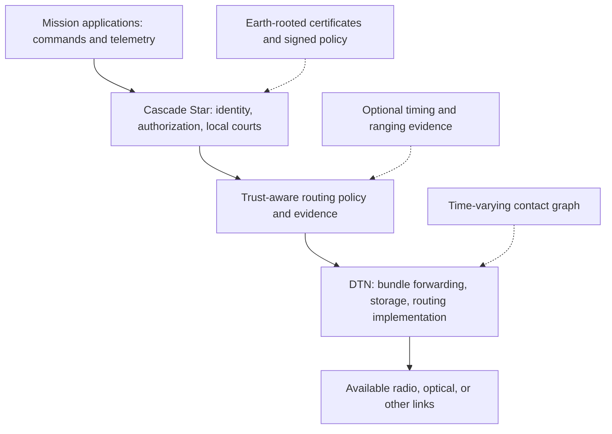

# Cascade Star

**A trust and routing architecture layered on Delay-Tolerant Networking (DTN) for interplanetary communications.**

> Trust, carried across space.

**Status:** Concept proposal. No implemented protocol, flight hardware, or validated security guarantees are claimed.

## Explore the project

Start with the **[threat model](docs/THREAT_MODEL.md)** before selecting protocols or topology.

- **[Concept brief](docs/CONCEPT_BRIEF.md)** — problem, principles, and scope.
- **[Minimum network and expansion rule](docs/MINIMUM_NETWORK.md)** — five candidate endpoints and measurable growth triggers.
- **[Mars autonomy](docs/MARS_AUTONOMY.md)** — local rotation, revocation, and emergency authority during Earth silence.

- **[Goals map](docs/GOALS.md)** — milestones and evidence needed to advance.
- **[Architecture draft](docs/ARCHITECTURE.md)** — delegated authority, local courts, and routing policy.
- **[Simulator plan](docs/SIMULATION_PLAN.md)** — ground experiments and evaluation criteria.

## The idea

Cascade Star adds delegated identity, authorization, local verification, and trust-aware routing policy to a DTN network. DTN carries bundles through long delays and intermittent contacts using store-and-forward delivery.

The “cascade” describes the expansion of delegated authority:

```text
1 → 10 → 40 → …
```

Growth follows measured traffic, coverage, outpost, or resilience requirements. These counts illustrate possible delegation expansion, not satellite counts, physical branches, required transmission paths, or voting thresholds. A child's certificate can trace back to an Earth-origin root while its messages travel through any eligible DTN route.

## Three distinct structures

| Structure | What it describes |
| --- | --- |
| Trust hierarchy | Who authorizes whom, within what scope, and for how long. |
| Contact graph | Which endpoints and relays can communicate at a given time, with what capacity and delay. |
| Decision policy | Which evidence or independent approvals are required to accept, forward, or execute a message. |

Delegation does not create a radio link. A physical connection does not grant command authority. A relay does not have to be the destination's certificate parent.

## Architecture layers



This is a proposed functional layering, not a standardized API. Cascade Star constrains which routes and actions are eligible; a DTN routing implementation selects feasible paths using contact opportunities and resources.

## Built on DTN

The starting point is **Bundle Protocol Version 7 ([RFC 9171](https://www.rfc-editor.org/rfc/rfc9171.html))** and **Bundle Protocol Security ([RFC 9172](https://www.rfc-editor.org/rfc/rfc9172.html))**.

BPv7 supplies bundle semantics. BPSec supplies security-block mechanisms; it does not by itself define Cascade Star's certificate hierarchy, key management, command authorization, or approval policy. Convergence-layer protocols provide transport over available links.

The design must specify how application signatures, BPSec protection, endpoint identifiers, and certificate identities fit together. Existing DTN implementations should be evaluated before creating a new transport.

## Earth-origin trust

- Each node has its own protected private key and a certificate chain to the root.
- Delegated issuers authorize children within bounded roles, scope, validity, and depth.
- Relay credentials permit forwarding; command credentials permit specified actions.
- A relay preserves the originating command's signed content.
- Signed, versioned trust updates distribute policy changes and revocations.

The root secret is not copied to every node. Public timing and gravity measurements do not supply secret key material. Root compromise requires a separately designed recovery procedure.

## Each node's court

A local court checks signatures, certificate scope, replay history, validity uncertainty, available trust updates, and any required independent approvals.

It may reject or hold a message, permit forwarding, or authorize execution at its destination. Forwarding permission is separate from execution permission. Several relays forwarding the same claim do not create several independent confirmations.

## Trust-aware routing

Cascade Star proposes policies that filter or rank otherwise feasible DTN routes using authenticated relay identity, permissions, trust-update freshness, and relevant evidence.

Contacts, bandwidth, storage, pointing, and expected delivery delay still determine physical feasibility. A route remains subject to bundle lifetime and mission policy. Missing contact does not prove malicious behavior, and trusted status does not create connectivity.

During an outage, bundles can wait in bounded storage. When another eligible contact becomes available, they may take a different route without changing their certificate chain or signed command.

## Physical evidence and limits

Timestamp exchanges, ranging, Doppler measurements, and orbit models can contribute consistency evidence with explicit uncertainty. Gravity and velocity corrections support clock comparison; they do not authenticate senders by themselves.

No specific constellation or straight chain is required by the architecture. Earth–Mars one-way propagation is roughly 3–22 minutes; storage, processing, and route selection can add delay. Cascade Star cannot reduce light-travel time.

## First milestone

Demonstrate a signed Earth-authorized command crossing a simulated DTN contact graph to a Mars endpoint. Break its original route, deliver through another eligible route, reject payload alteration, and avoid repeating a completed action on replay.

Use independent trust and contact graphs. Compare ordinary DTN routing with Cascade Star policies on the **same** contacts and resource budgets. Measure delivery, latency, overhead, revocation exposure, and unauthorized execution. Record when additional policy reduces availability as well as when it helps.

A synthetic ground model does not establish orbital feasibility or production security.

## Roadmap

1. Review the threat model, then define mission requirements and authorization boundaries.
2. Specify delegation, messages, local court rules, and disconnected operation.
3. Map the architecture onto BPv7, BPSec, and a chosen DTN implementation.
4. Build the five-endpoint ground MVP: Earth, one candidate L4/L5 relay, two Mars orbiters, and a surface node, with independent trust and contact structures.
5. Evaluate fault behavior and compare policies fairly.
6. Study realistic contact plans and link budgets for a selected mission.
7. Validate with a small experiment and expand only when results justify it.

## Contributing

Useful contributions include DTN integration designs, threat-model reviews, routing-policy studies, and reproducible experiments. Distinguish proposed behavior from measured results. Cascade Star does not claim that delegated certificates, DTN, or physical timing checks are individually new.
