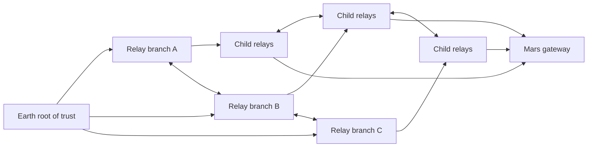

# Cascade Star

**An Earth-rooted, branching network for trusted interplanetary communications.**

> Trust, carried across space.

**Status:** Concept proposal. No flight hardware, implemented protocol, or validated security guarantees are claimed.

## Explore the project

- **[Goals map](docs/GOALS.md)** — milestones and the evidence needed to advance.
- **[Architecture draft](docs/ARCHITECTURE.md)** — message flow, local courts, delegation, and branch recovery.
- **[Simulator plan](docs/SIMULATION_PLAN.md)** — the first ground experiment and how to measure its results.

## The idea

Cascade Star grows outward from an Earth-origin root of trust through successive layers of relay nodes:

```text
1 → 10 → 40 → …
```

These numbers illustrate branching growth; they are not fixed deployment requirements. Each node verifies, stores, and forwards messages. Cross-links between branches provide alternate routes and independent observations.

The goal is to deliver authenticated messages across long distances, interrupted links, and partially faulty networks, beginning with Earth–Mars communications.

## Network concept



This diagram shows logical trust and forwarding relationships. Actual radio or optical links depend on distance, pointing, visibility, power, and orbital motion. A certificate relationship does not guarantee a physical connection.

## Earth-origin trust

The founding “seed” is an Earth-origin cryptographic trust anchor. It is not a secret copied into every satellite, and it is not derived solely from public timing or gravity measurements.

- Every node holds the root public key and has its own protected private key.
- Certificates identify nodes and define their permissions.
- Delegated parents may authorize children within explicit limits.
- Relays preserve the original signed message; forwarding authority does not grant authority to rewrite commands.
- Signed updates distribute certificate changes and revocations.

Independent node keys allow a compromised branch to be isolated without automatically replacing every node’s key. A compromise of the root itself requires a separately designed recovery procedure.

## Each node’s court

Each node runs a local verification process—its “court”—before accepting or forwarding traffic. It checks:

1. The sender’s signature and certificate chain.
2. Whether the sender is authorized for the requested action.
3. Command identifiers, sequence numbers, and replay history.
4. Validity windows, accounting for clock uncertainty and expected delivery delay.
5. Relevant independent observations and endorsements when a decision requires them.

Acceptance for forwarding and authorization to execute a command are separate decisions. A local court cannot unilaterally grant network-wide authority.

## Physical timing checks

Nodes exchange timestamped signals and compare measured travel times and Doppler shifts with predicted motion. Two-way exchanges help constrain clock offsets and propagation delays, with appropriate motion and path models.

Gravity and velocity corrections relate onboard clock readings to a defined reference timescale. Deep-space models must account for relevant bodies, including the Sun and planets, rather than Earth alone.

These checks can reveal inconsistencies in reported timing or position. They require clocks, orbit estimates, uncertainty bounds, and independent measurements. They do not create secret keys or prove a sender’s identity by themselves.

## Routing across space

Cascade Star uses a delay-tolerant approach:

- Store messages when the next link is unavailable.
- Forward during predicted contact windows.
- Select routes using capacity, delay, availability, and authorization policies.
- Use cross-links to bypass failed or suspect relays where alternatives exist.
- Preserve signed content and record delivery acknowledgments.

Relay placement must follow changing planetary geometry. A fixed straight chain will not stay aligned between Earth and Mars.

Relays may improve coverage or link performance, but that benefit must be demonstrated with link budgets and orbital simulations. They do not reduce light-travel time. Earth–Mars one-way propagation is roughly 3–22 minutes, with additional delays from routing, storage, and processing.

## Faults and agreement

The design must address forged messages, replay attacks, compromised authorized nodes, outages, and network partitions.

Many descendants repeating a parent’s claim do not constitute independent evidence. Agreement must use distinct authorized participants and an explicit protocol with stated fault and connectivity assumptions.

Global real-time consensus is not assumed. Local decisions and delayed reconciliation need defined rules, particularly for conflicting commands, expired credentials, and revocation updates that have not yet arrived.

## First milestone: a simulated cascade

Build a ground-based simulator before selecting a flight constellation.

The simulator should model branching relays and cross-links, contact windows, propagation delay, clock uncertainty, finite storage, and node failures. Introduce forged traffic, replays, and compromised nodes as test cases.

Success means demonstrating that:

- Authorized messages arrive intact when a viable route exists before expiration.
- Modified and unauthorized commands are rejected.
- Duplicate commands are not executed twice.
- Messages survive temporary outages within configured storage limits.
- A compromised parent cannot forge an Earth-signed command.
- Routing can recover from a failed branch when an alternate path exists.
- Partitions and unavailable revocation information produce explicitly defined behavior.

Compare results against a direct Earth–Mars link and a simpler relay network. Measure delivery rate, latency, bandwidth and storage costs, and fault recovery.

## Roadmap

1. Define mission requirements and the threat model.
2. Specify message formats, certificates, delegation, and root recovery.
3. Define timing uncertainty, replay protection, and disconnected-operation rules.
4. Simulate orbital coverage and calculate radio or optical link budgets.
5. Implement and evaluate the ground demonstrator.
6. Validate timing and forwarding with a small flight experiment.
7. Expand only when measurements justify additional nodes.

## Open questions

- Which commands require multiple independent approvals?
- How long may a disconnected node accept credentials without a revocation update?
- How are a compromised root and lost node keys recovered?
- Which orbital layouts provide useful alternate paths?
- What clock accuracy and ranging performance are necessary?
- Where do relays outperform direct communication enough to justify their cost?

## Contributing

This repository begins as a concept document. Useful contributions include threat-model reviews, protocol proposals, orbital simulations, link-budget studies, and reproducible experiments. State assumptions clearly and distinguish measured results from proposed capabilities.
