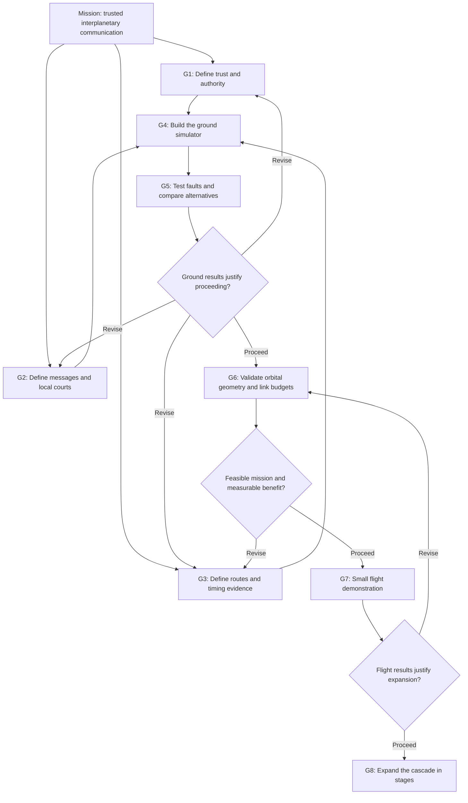

# Cascade Star goals map

**Mission:** Carry verifiable messages from Earth across an expanding interplanetary network, despite delay, outages, and some compromised nodes.

**Current position:** Concept documented. Architecture and simulator plans drafted. Software, security validation, orbital studies, and hardware demonstrations remain ahead.

## The path

## Goals and checkpoints

| Goal | What we produce | Evidence required to move forward | Status |
| --- | --- | --- | --- |
| G1 — Establish trust | Threat model, certificate rules, bounded delegation, revocation and root recovery design | Explain how a compromised relay or issuer is contained, and document remaining exposure | Draft architecture; detailed specification open |
| G2 — Define the local court | Signed message format, replay rules, forwarding and execution decisions, conflict policy | Walk through a valid command, altered command, replay, uncertain clock, and restart without ambiguous decisions | Draft architecture; detailed specification open |
| G3 — Define routing and timing | Contact model, queue limits, alternate paths, clock uncertainty and physical evidence rules | Demonstrate on paper how one message survives an outage and how missing evidence changes its eligibility | Draft architecture; detailed specification open |
| G4 — Build a ground cascade | Deterministic simulator of 1 → 10 → 40, with cross-links and separate endpoints | A repeatable command journey and signed return result, with bounded node resources | Planned |
| G5 — Challenge the design | Fault scenarios and comparison with direct and simple relay links | Reproducible delivery, rejection, replay, recovery, overhead, and revocation results; report failures | Planned |
| G6 — Test physical feasibility | Candidate orbits, contact schedules, radio or optical link budgets, power and pointing estimates | Realistic links meet agreed mission requirements and show a benefit worth the added resources | Not started |
| G7 — Validate in flight | A small experiment for timing, authenticated forwarding, and interrupted contacts | Measurements meet predeclared tolerances; discrepancies are explained | Not started |
| G8 — Grow the network | Staged deployment with independently tested branches and cross-links | Each expansion improves agreed coverage, capacity, or resilience metrics at acceptable cost | Future |

G6 can begin with exploratory studies earlier, but flight commitment depends on both credible physical feasibility and ground validation. The map describes decision dependencies, not a fixed calendar.

## First practical target

**Send one Earth-authorized command through the simulated cascade to Mars, break its original relay path, and deliver it intact over an alternate branch.**

The destination must verify the command, apply duplicate protection, and return a signed result. Replaying the command must not repeat the completed simulated action. Changing its payload must make verification fail.

This establishes the smallest useful demonstration of the concept. It does not yet establish spacecraft feasibility or resistance to every attacker.

## Decisions to make first

1. Choose one simulated command and define its authorized sender and destination.
2. Choose a canonical signing format and standard cryptographic library.
3. Define the local court's reject, hold, forward, and execute rules.
4. Set explicit contact schedules, delays, storage limits, and expiration policy.
5. Define the failure scenario and expected outcome before implementing it.

## Measures of progress

- Authorized delivery before expiration.
- Unauthorized executions and repeated completed actions.
- Delivery and confirmation delay.
- Recovery when an alternate route is available.
- Bandwidth, verification workload, and storage cost.
- Time until a revocation becomes effective at each reachable node.

Set numerical targets after mission requirements and baseline measurements exist. Node counts and signatures alone are not success criteria.

## Supporting drafts

- [Architecture](ARCHITECTURE.md): roles, messages, local courts, trust, and recovery.
- [Simulator plan](SIMULATION_PLAN.md): scenarios, comparisons, metrics, and deliverables.

No deployment date or validated security claim is attached to these goals. The next milestone is a specified, reproducible ground experiment.
