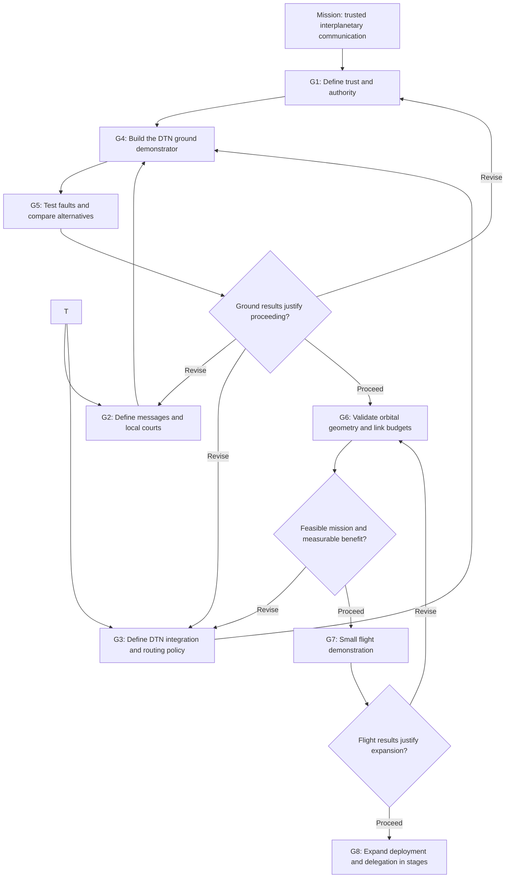

# Cascade Star goals map

**Mission:** Layer delegated trust, local verification, and routing policy on DTN to carry verifiable interplanetary messages despite delay, outages, and some compromised nodes.

**Current position:** DTN-layered concept documented. Architecture and simulator plans drafted. The cascade describes delegated authority; physical links form an independent contact graph. Software, standards integration, security validation, and mission studies remain ahead.

Start with the [threat model](THREAT_MODEL.md), then the [minimum network](MINIMUM_NETWORK.md) and [Mars autonomy policy](MARS_AUTONOMY.md).

## The path

## Goals and checkpoints

| Goal | What we produce | Evidence required to move forward | Status |
| --- | --- | --- | --- |
| G1 — Establish trust | Threat model, certificate rules, bounded delegation, revocation and root recovery design | Explain how a compromised relay or issuer is contained, and document remaining exposure | Draft architecture; detailed specification open |
| G2 — Define the local court | Signed message format, replay rules, forwarding and execution decisions, conflict policy | Walk through a valid command, altered command, replay, uncertain clock, and restart without ambiguous decisions | Draft architecture; detailed specification open |
| G3 — Define DTN integration and routing | BPv7/BPSec mapping, endpoint identity binding, policy interface, contact model, clock uncertainty rules | Show how a command uses an eligible DTN route outside its certificate ancestry and handles missing evidence | Draft architecture; integration specification open |
| G4 — Build a ground demonstrator | Five-endpoint DTN MVP with independent contact and delegation graphs, plus Mars autonomy tests | Repeatable command delivery outside certificate-parent paths; bounded resources and stated standards coverage | Planned |
| G5 — Challenge the design | Fault scenarios comparing DTN baseline and Cascade Star policies on identical contacts and resources | Reproducible delivery, rejection, replay, recovery, overhead, and revocation results; report policy costs and failures | Planned |
| G6 — Test physical feasibility | Candidate orbits, contact schedules, radio or optical link budgets, power and pointing estimates | Realistic links meet agreed mission requirements and show a benefit worth the added resources | Not started |
| G7 — Validate in flight | A small experiment for timing, authenticated forwarding, and interrupted contacts | Measurements meet predeclared tolerances; discrepancies are explained | Not started |
| G8 — Grow the network | Staged deployment with independently tested branches and cross-links | Each expansion improves agreed coverage, capacity, or resilience metrics at acceptable cost | Future |

G6 can begin with exploratory studies earlier, but flight commitment depends on both credible physical feasibility and ground validation. The map describes decision dependencies, not a fixed calendar.

## First practical target

**Send one Earth-authorized command through the five-endpoint DTN model to the Mars surface node, break its original route, and deliver it intact over another eligible route outside its certificate branch. Then demonstrate scoped local key renewal while Earth is silent.**

The destination must verify the command, apply duplicate protection, and return a signed result. Replaying the command must not repeat the completed simulated action. Changing its payload must make verification fail.

This establishes the smallest useful demonstration of the concept. It does not yet establish spacecraft feasibility or resistance to every attacker.

Expansion follows the [measurable growth rule](MINIMUM_NETWORK.md#expansion-rule): add nodes for a documented traffic, coverage, new-outpost, or resilience shortfall, then verify improvement against the baseline.

## Decisions to make first

1. Choose one simulated command and define its authorized sender and destination.
2. Choose a canonical signing format and standard cryptographic library.
3. Define the local court's reject, hold, forward, and execute rules.
4. Specify the BPv7/BPSec mapping and build contact schedules independently of the certificate hierarchy; set delays, storage limits, and expiration policy.
5. Define the failure scenario and expected outcome before implementing it.

## Measures of progress

- Authorized delivery before expiration.
- Unauthorized executions and repeated completed actions.
- Delivery and confirmation delay.
- Recovery when an alternate route is available.
- Bandwidth, verification workload, and storage cost.
- Time until a revocation becomes effective at each reachable node.

Set numerical targets after mission requirements and baseline measurements exist. Node counts and signatures alone are not success criteria.

## Supporting drafts

- [Architecture](ARCHITECTURE.md): roles, messages, local courts, trust, and recovery.
- [Simulator plan](SIMULATION_PLAN.md): DTN integration, independent graph scenarios, policy comparisons, and metrics.

No deployment date or validated security claim is attached to these goals. The next milestone is a specified, reproducible ground experiment.
