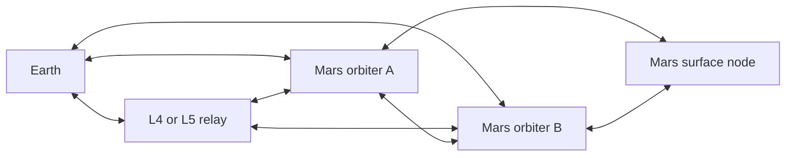

# Minimum viable DTN network
**Status:** Ground-demonstration configuration; physical feasibility unverified.

## Five logical endpoints
Following the concept brief:
1. Earth ground segment.
2. One relay near Sun–Earth L4 **or** L5; the location is a candidate requiring study.
3. Mars orbiter A.
4. Mars orbiter B.
5. One Mars surface node.

Two orbiters add a candidate local alternative path beyond the earlier four-node sketch. Root signers, recovery signers, and regional administrative roles are logical security roles, not additional spacecraft in this count.

## Candidate contacts

Edges mean contacts to evaluate, not continuously available links. A chosen contact plan must model occultations, antenna or optical pointing, capacity, propagation, and outage windows. Surface visibility varies with orbiter motion; orbiter cross-links need their own feasibility check.

Sun–Earth L4/L5 is not assumed to “see around the Sun” successfully for this mission. Evaluate Sun-separation angles at every terminal, link budgets, station keeping, pointing constraints, and total relay delay. Remove or revise candidate edges that fail those checks.

## Ground MVP behavior
Send an authenticated command to the surface node, carry its signed result back to Earth, change physical routes without changing trust ancestry, and reject unauthorized commands.

Separately simulate an Earth-contact blackout with continuing Mars-local contacts. Regional rotation, revocation, and emergency restrictions must operate without an Earth response. The blackout tests autonomy; any candidate conjunction relay tests availability. Neither test substitutes for the other.

## Conjunction assumptions
Earth–Mars one-way light time is roughly 3–22 minutes. Solar conjunction recurs roughly every 26 months. A two-week Earth-facing command blackout is a useful scenario, not a universal physical duration: actual restrictions depend on geometry, link technology, and mission policy.

Run both a functioning alternative Earth route and a complete Earth partition. This prevents assuming the L4/L5 relay solves every blackout.

## Expansion rule
Add a node only when a measured requirement cannot be met by the current design and the proposed addition demonstrably improves it:
- Offered traffic exceeds the agreed delivery or capacity target.
- A new outpost requires an authorized service endpoint.
- Contact simulation misses an agreed coverage or latency target.
- Fault analysis misses an agreed route-diversity or availability target.

For each addition, document the trigger, baseline shortfall, candidate contacts, credentials and authority scope, resource cost, and measured improvement. Do not add a layer merely to reach 1 → 10 → 40. Trust delegation may grow independently of the physical network.

Threshold values remain mission requirements to choose; no arbitrary numerical targets are claimed.
